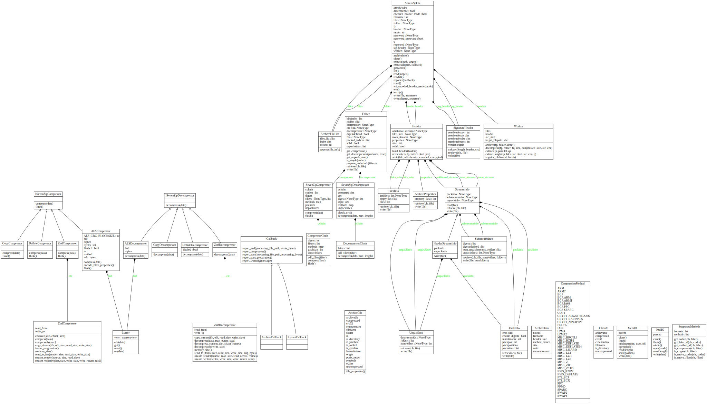

:tocdepth: 2

==================
Design and Classes
==================

.. _design:

Design
======

class diagram
-------------

.. _internal_classes:

Internal classes
================

.. _archivefile-objects:

ArchiveFile Objects
-------------------

.. autoclass:: py7zr.py7zr.ArchiveFile
    :members:

.. _archiveinfo-objects:

archiveinfo module
------------------

.. automodule:: py7zr.archiveinfo
    :members:

compression module
------------------

.. automodule:: py7zr.compression
    :members:

helpers module
--------------

.. automodule:: py7zr.helpers
    :members:

